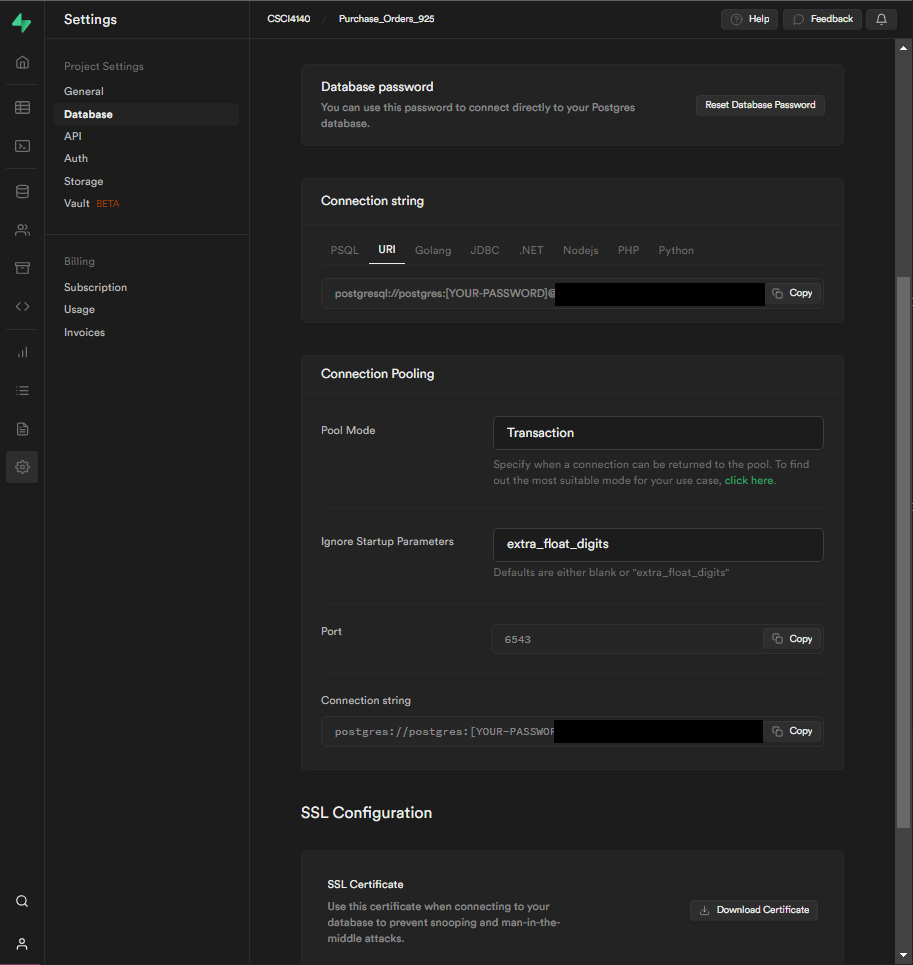

# Background

## Task:
Create a web application that allows users to create, read, update and delete (CRUD) data from a Purchase Order database. The application should be built using Node.js, Express.js and PostgreSQL.


### Technical Inventory
* **Node.js**: A JavaScript runtime engine.
* **Express**: A web application framework for Node.js.
  * **EJS**: A templating engine for Node.js.
* **PostgreSQL**: An open-source relational database management system.
  * **Supabase**: A service that provides free database hosting for learning and prototyping.

### Node.js:
Node.js is an open-source, cross-platform, JavaScript runtime environment that executes JavaScript code outside of a browser. Node.js lets developers use JavaScript to write command line tools and for server-side scripting. Node.js is part of the "JavaScript everywhere" paradigm, unifying web application development around a single programming language, rather than different languages for server-side and client-side scripts. [Here is a guide to getting started with Node.js](https://nodejs.org/en/docs/guides/getting-started-guide/).

### Express.js
Express has been called the de facto standard server framework for Node.js. Express provides a minimal and flexible set of features for creating web applications and APIs. It provides a set of features like routing, middleware, view system, etc. It simplifies the server creation process that can be used to create a web application more easily and quickly. [Here is a guide to getting started with Express.js](https://expressjs.com/en/starter/installing.html).

#### EJS
EJS is a templating engine for Node.js. It allows you to embed JavaScript into HTML files. It is a simple templating language that lets you generate HTML markup with plain JavaScript. [Here is a guide to getting started with EJS](https://ejs.co/#docs).

You can install express globally and use the express command to generate a new application by executing the following command in your terminal:
```bash
npm install -g express-generator
```

or

```bash
npx express-generator
```

Then, you can generate a new site in your current directory with the following command, specifying EJS as the view engine:
```
express --view=ejs
```

This will generate a website with a simple file structure that looks like this:
```
.
├── app.js
├── bin
│   └── www
├── package.json
├── public
├── routes
└── views
```


### Working with Supabase

Sign in to Supabase and create a new project. Then, retrieve the URL and API key from the project settings page. You will need these to connect to your database. Carefully store the generated password and URL in a secure location. You will need these to connect to your database.

#### Retrieving the postgres server URL from the project settings page:
The connection string can be retrieved from the project settings page. Click on the project settings icon in the left sidebar, then click on the "Database" tab. The connection string is displayed under the "Connection string" heading.


### Creating a .env file:

To store environment variables, create a .env file in the root directory of your project. The .env file should contain the following variables:

```
DB_PASS=[your database password]
DB_URL=[your database url]
```

### PostgreSQL

Install the `pg-promise` package:

```bash
npm install pg-promise
```

Include the `pg-promise` package in the list of required modules in `app.js`:

```js
var createError = require('http-errors');
var express = require('express');
var path = require('path');
var cookieParser = require('cookie-parser');
var logger = require('morgan');
var pgp = require('pg-promise')();
```

Then, require set the values database password and url from the environment variables in `app.js` file:
```js
var dbPass = process.env.DB_PASS;
var dbUrl = process.env.DB_URL;

```

Then create a new database object named `db` using the `pgp` function and the database url:
```js
var db = pgp(`postgres://postgres:${dbPass}@${dbUrl}:5432/postgres`)
```


### Deployment:
#### Github
For ease of integration with Repl.it, I have deployed the application on Github. You can view the publi c repository [here](https://github.com/LiamOsler/postgres-express-REST)

#### Repl.it
For ease of access, I have deployed the application on Repl.it. You can view the application [here]().

##### Deployment Pipeline:
When a commit is pushed to the main branch, the application is automatically deployed to Repl.it. The most recent version of the application can be viewed [here](). 

# References
## Blogs, tutorials and videos:
Net Ninja Express Tutorials:
https://www.youtube.com/watch?v=yXEesONd_54

## Documentation:
Node.js:
https://nodejs.org/en/

Express:
https://expressjs.com/en/guide/using-template-engines.html

